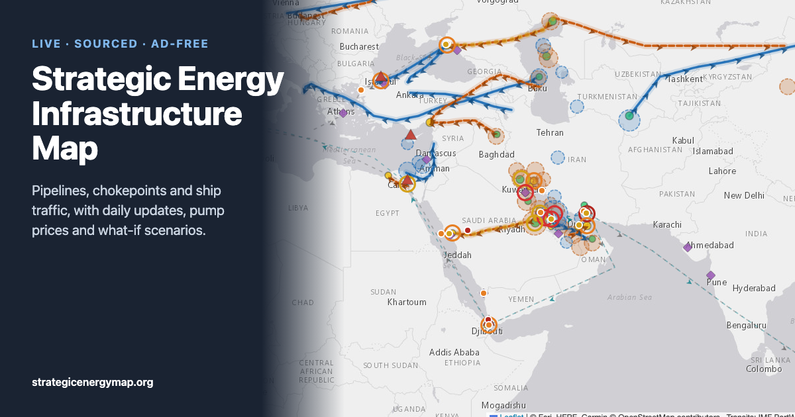

# Strategic Energy Infrastructure Map

**Live:** https://strategicenergymap.org · **About & methods:** https://strategicenergymap.org/about.html

A free, ad-free map of the world's oil and gas infrastructure — pipelines, fields, refineries, LNG terminals, ports, shipping routes and chokepoints — and what is happening to them now. A scheduled research agent keeps it current, with a source behind every claim.



## What it does

- **~170 facilities** across Europe, the Middle East, Asia and the Americas, each with capacity details and geopolitical context.
- **Live chokepoint traffic** from [IMF PortWatch](https://portwatch.imf.org/), loaded in the browser and compared with the pre-crisis baseline.
- **Sourced daily updates**: an event feed and facility status (reduced, disrupted, offline, damaged, closed), each linked to its sources with a confidence label.
- **Pump prices**: weekly petrol and diesel prices for the US (national and regional), all EU member states and the UK, from official statistics.
- **What-if mode**: close one or more chokepoints to see cut routes, usable bypass capacity (adjusted for facilities currently impaired), stranded assets, the net oil shortfall and the most exposed importers.
- **Embeddable**: add `?embed=1` (and optionally `&region=europe|mideast|asia|americas`) for a map-only view. The About page has a ready-made iframe snippet with a copy button ([about.html#embed](https://strategicenergymap.org/about.html#embed)).

## How it's built

No framework and no dependencies. The map is a static page that renders JSON; a small build script (`scripts/build.mjs`) also generates ~150 crawlable answer pages from the same data: one per chokepoint, major facility and pump-price series, plus hubs, an events archive, an RSS feed, `sitemap.xml` and `robots.txt`.

```
index.html, styles.css, app.js   the map (Leaflet 1.9.4); renders everything from data/
about.html                       about & methods page, changelog
data/infrastructure.json         facilities, pipelines, routes, chokepoints (stable kebab-case ids)
data/status.json                 facilities not operating normally
data/events.json                 dated, sourced event feed + situation summary
data/market.json                 benchmark prices
data/fuel.json                   pump prices (written by scripts/update_fuel.py)
data/scenarios.json              what-if baselines, bypass capacity, exposure
data/changelog.json              public changelog
scripts/update_fuel.py           pulls EIA, EU Weekly Oil Bulletin, UK DESNZ and ECB FX (Python stdlib only)
scripts/validate.mjs             schema, reference and sourcing checks for data/
agent/UPDATE_AGENT.md            instructions for the daily update agent
agent/SCHEMA.md                  data contract
```

Hosted on Vercel from `main`. Visits are counted with Vercel Web Analytics (no cookies).

## The update agent

A Claude Code cloud routine runs every morning and follows [`agent/UPDATE_AGENT.md`](agent/UPDATE_AGENT.md). It:

1. refreshes pump prices from the official feeds,
2. researches energy-relevant developments since its last run,
3. updates events, facility status, prices and the changelog,
4. runs `scripts/validate.mjs`, then
5. publishes routine changes to `main` and opens a pull request for anything needing human review: new facilities, critical events, chokepoint status changes, corrections.

**Sourcing rule.** Governments that are parties to the conflicts on the map (the US, Israel, Iran, the Houthis, Russia and Ukraine) are treated alike. Their statements count as fact only when they can be independently verified; otherwise they are attributed and marked *unverified*. Ship transits and flows through contested waters come only from independent trackers. If there's no independent figure, the map shows none. The validator enforces part of this automatically.

## Social posts

The agent also drafts short posts in `data/social.json`, checked by the validator (length, sourcing, no unverified
claims). A GitHub Action (`.github/workflows/social.yml`) posts them to X and Bluesky with repository secrets and
records what went out in `data/social-log.json`. Drafts tied to review items only post once a human merges them.
Set `"enabled": false` to pause everything. Weekly chart images are rendered from `dist/social/*.html`.

## Run locally

`fetch()` doesn't work from `file://`, so serve the folder:

```bash
node scripts/build.mjs && python3 -m http.server 8765 -d dist
```

Then open http://localhost:8765. After editing anything in `data/`:

```bash
node scripts/validate.mjs
```

Refresh pump prices:

```bash
python3 scripts/update_fuel.py
```

### Link-preview image

`og.png` is rendered from `tools/og-card.html` (copied into `dist/tools/` by the local build) with headless Chrome while the local server is serving `dist/`:

```bash
"/Applications/Google Chrome.app/Contents/MacOS/Google Chrome" --headless=new --user-data-dir="$(mktemp -d)" --hide-scrollbars --window-size=1200,630 --virtual-time-budget=12000 --screenshot="$PWD/og.png" http://localhost:8765/tools/og-card.html
```

## Data and attribution

Basemap © Esri, HERE, Garmin, © OpenStreetMap contributors. Ship transits: IMF PortWatch. Pump prices: US EIA, European Commission Weekly Oil Bulletin, UK DESNZ, ECB reference rates. Hormuz baselines: IEA (Kpler data). Every event and status links its own sources.

Found an error? [Open an issue](https://github.com/courtney-pivotwave/energy-infrastructure-map/issues/new).

Built by [Courtney Wilson](https://www.linkedin.com/in/courtneyhwilson/).
